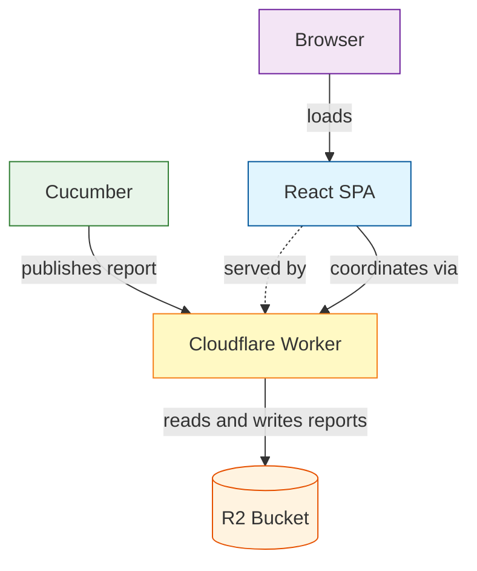
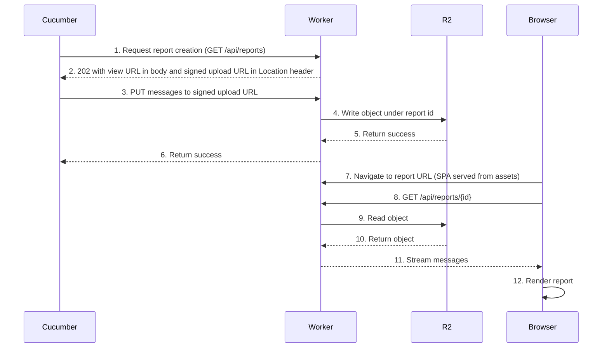
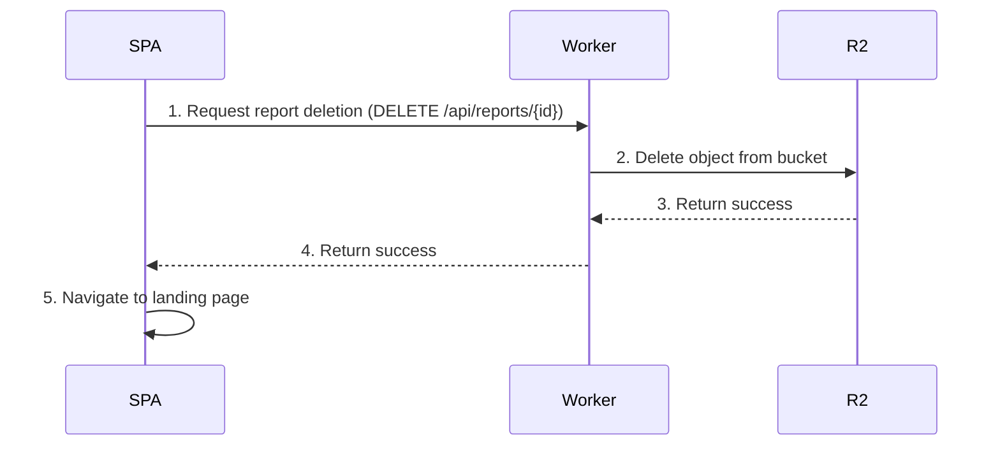

# Architecture

## Context

When we say you "publish a report" to Cucumber Reports, what we mean is that Cucumber (the thing you run the tests with e.g. cucumber-jvm) generates a stream of [Cucumber Messages](https://github.com/cucumber/messages) (the firehose of events from the test run), and sends those messages to Cucumber Reports (the service), so it can later render them as a human-readable report. In other words, the service is a repository for messages, with a coordination and view layer on top of them.

The main goals of this architecture are to be easy to maintain and cheap to run. We'll tolerate some platform coupling to get this.

## High-level architecture

At a high level, the service has two runtime pieces, both on Cloudflare:

- A [Cloudflare R2](https://developers.cloudflare.com/r2/) bucket for storing report envelopes as JSONL
- A [Cloudflare Worker](https://developers.cloudflare.com/workers/) that handles the `/api/reports*` HTTP endpoints and also serves the React single-page application (SPA), built with Vite, via its static assets binding

The user is interacting with this from two places:

- Cucumber, with which they execute a test run — this interacts only with the Worker, which mediates writes to R2
- A browser, with which they subsequently view the report — this loads the SPA from the Worker, and the SPA in turn calls the Worker's API, which mediates reads and deletes against R2

## Sequences

### Publishing a report

### Deleting a report

## Request signing

Upload URLs work much like S3 presigned URLs: each one is scoped to a single object and carries a TTL, so it can't be reused to clobber other reports or linger indefinitely. We sign them with HMAC, keeping the Worker stateless and cheap to run.

## Compression

Cucumber messages are JSONL and repeat a lot of structure, so they compress well. Cucumber implementations are free to upload them raw or pre-gzipped; either way, we store the bytes in R2 as they arrive. On the way back out, the Worker decompresses gzipped objects itself, then hands the stream off to the Cloudflare edge, which negotiates transport compression with the client — usually zstd or brotli for modern browsers.

